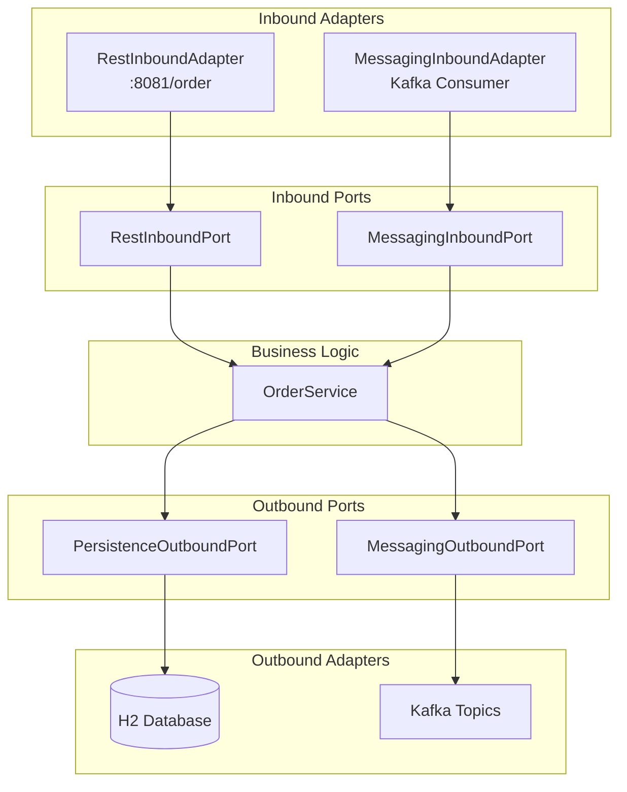

# Training Materials - Cohesion Improvement Proposals

**Analysis Date:** 2025-01-15
**Analyst Role:** Experienced Microservices Architecture Trainer
**Focus:** End-to-end information delivery cohesion

---

## Executive Summary

The training materials demonstrate strong foundational content but have **critical gaps** in connecting documentation to code examples. Key improvements needed:

1. **Missing README files** in critical modules (80% gap)
2. **Weak linkage** between exercises and actual code (Day 1-3)
3. **No visual architecture diagrams** in code repositories
4. **Inconsistent naming conventions** between docs and code
5. **Missing "learning path" navigation** between resources

**Impact:** Participants may struggle to find relevant code examples, leading to confusion and reduced learning effectiveness.

---

## Gap Analysis

### 1. Documentation-to-Code Traceability (CRITICAL)

**Issue:** Exercises reference code locations, but those locations lack context.

**Examples:**
- Day 1 Exercise 2 references `reference-services/order-service/.../inbound/adapter/RestInboundAdapter.java`
  - ✅ File exists
  - ❌ No README in order-service explaining its purpose
  - ❌ No inline comments explaining hexagonal architecture
  - ❌ No diagram showing adapter/port relationships

- Day 1 Exercise 3 asks participants to implement Menu Service
  - ❌ No starter template in `workshop-services/`
  - ❌ No working example to reference
  - ❌ `hexagonal-architecture-example` exists but is not referenced in Day 1 exercises

**Impact:** HIGH - Participants waste time searching for examples

**Proposed Solutions:**

#### 1.1 Add README files to all key modules
```
reference-services/
├── order-service/README.md          [MISSING - ADD]
├── billing-service/README.md        [MISSING - ADD]
├── customer-service/README.md       [MISSING - ADD]
├── restaurant-service/README.md     [MISSING - ADD]
├── delivery-service/README.md       [MISSING - ADD]
└── common-support/README.md         [MISSING - ADD]

architectural-examples/
├── hexagonal-architecture-example/README.md  [MISSING - ADD]

monolithic-application/README.md     [MISSING - ADD]
```

**README Template Structure:**
```markdown
# [Service Name]

## Purpose
What business capability does this service handle?

## Architecture
- Pattern: Hexagonal Architecture
- Ports: [List inbound/outbound ports]
- Adapters: [List adapters and their purpose]

## Key Files to Study
- `service/OrderService.java` - Core business logic
- `inbound/adapter/RestInboundAdapter.java` - REST API entry point
- `outbound/adapter/MessagingOutboundAdapter.java` - Kafka publisher

## Running This Service
1. Start dependencies: Kafka, Database
2. Run: `mvn spring-boot:run`
3. Access: http://localhost:8081

## Related Training Materials
- Day 2 Exercise 1: Uses this service as reference for REST APIs
- Day 3 Exercise 1: Demonstrates saga orchestration
- See: docs/Microservices interactions.md for message flows
```

#### 1.2 Create explicit cross-references in exercises

**Current (Day 1, Exercise 3):**
> "Create a Menu Service using hexagonal architecture"

**Improved:**
```markdown
### Reference Example
📚 **Study first:** `architectural-examples/hexagonal-architecture-example/`
- Simple, focused example demonstrating ports & adapters
- See `RestAdapter.java` → `RestPort` → `BusinessLogicService` flow

### Production Example
📚 **Advanced reference:** `reference-services/order-service/`
- Complete production-grade implementation
- Study structure, then simplify for your Menu Service
```

---

### 2. Hexagonal Architecture Example Underutilization (HIGH PRIORITY)

**Issue:** `hexagonal-architecture-example` exists but is:
- ❌ Not referenced in Day 1 exercises
- ❌ Has no README explaining its purpose
- ❌ Not listed in main README.md
- ❌ Uses generic naming (`BusinessLogicService`) instead of domain concepts

**Impact:** HIGH - Perfect teaching tool going unused

**Proposed Solutions:**

#### 2.1 Add comprehensive README
```markdown
# Hexagonal Architecture Example

## Purpose
**Simplified reference implementation** for Day 1 training exercises.
Demonstrates hexagonal architecture with minimal complexity.

## What This Example Shows

### The Problem (Traditional Layered Architecture)
❌ Controllers directly call repositories
❌ Business logic mixed with framework code
❌ Hard to test without full Spring context
❌ Technology changes require business logic changes

### The Solution (Hexagonal Architecture)
✅ Adapters isolated at boundaries
✅ Business logic has ZERO framework dependencies
✅ Easy to test with simple mocks
✅ Can swap REST for gRPC without touching business logic

## Architecture Diagram
[Include ASCII or image diagram]

## File-by-File Explanation
### Inbound Side (Driving)
- `RestAdapter.java` - HTTP entry point
  - Uses `@RestController` (Spring framework)
  - Depends on `RestPort` (interface, NOT implementation)
  - **Key:** Adapter knows about framework, port does not

- `RestPort.java` - Contract for inbound operations
  - Pure Java interface
  - No Spring annotations
  - Defines WHAT operations exist, not HOW

### Core (Business Logic)
- `BusinessLogicService.java` - Domain logic
  - `@Service` is only Spring dependency (for DI)
  - Implements `RestPort` (inbound contract)
  - Depends on `MessagingPort` (outbound contract)
  - **Key:** Depends on interfaces, not implementations

### Outbound Side (Driven)
- `MessagingPort.java` - Contract for external dependencies
  - Pure Java interface
  - Business logic calls this, adapter implements it

- `MessagingAdapter.java` - Kafka implementation
  - Contains framework-specific code
  - Implements `MessagingPort`
  - **Key:** Can be swapped for RabbitMQ adapter without changing business logic

## How to Use This Example (Day 1 Training)
1. **Study the flow:** REST request → Adapter → Port → Service → Port → Adapter → Kafka
2. **Identify dependencies:** Notice arrows all point INWARD toward business logic
3. **Compare with monolith:** Open `monolithic-application/OrderService.java` - see direct dependencies
4. **Implement Menu Service:** Use this structure as your template

## Running the Example
[Include commands]

## What's Intentionally Simple
- No database (keeps focus on architecture)
- No complex business logic (focus on structure, not domain)
- No authentication (one concept at a time)

## Next Steps
After understanding this example, study `reference-services/order-service/` for production patterns.
```

#### 2.2 Update Day 1 Exercise 2 to reference it explicitly

Add this section before "Part A":
```markdown
### 📚 Recommended Study Path
**Before starting this exercise:**
1. Open `architectural-examples/hexagonal-architecture-example/`
2. Read the README.md
3. Study the code structure (10 minutes)
4. Run the example locally
5. Then proceed to compare with order-service
```

---

### 3. Monolithic Application Documentation (MEDIUM PRIORITY)

**Issue:** Monolith is used in Day 1 Exercise 1 but lacks context

**Current state:**
- ❌ No README explaining its purpose
- ❌ No comments in code explaining "why this is problematic"
- ❌ No comparison diagram (monolith vs microservices)

**Proposed Solutions:**

#### 3.1 Add README.md to monolithic-application
```markdown
# Epic Eats Monolithic Application

## Purpose
Reference implementation showing **problematic patterns** that microservices solve.
Used in Day 1 Exercise 1 for service decomposition analysis.

## What This Application Demonstrates

### Architecture: Traditional 3-Tier Layered
- **Controller Layer:** HTTP endpoints
- **Service Layer:** Business logic
- **Repository Layer:** Database access

### The Problems (Why We Need Microservices)

#### Problem 1: Tight Coupling
**See:** `OrderService.java` lines 26-38
```java
private final CustomerService customerService;
private final RestaurantService restaurantService;
private final MenuItemService menuItemService;
```
**Issue:** Order service directly depends on 3 other services
**Impact:** Cannot deploy Order changes without testing ALL dependencies

#### Problem 2: Shared Database
**See:** All entities in `model/` package
**Issue:** Order, Customer, Restaurant all share same database
**Impact:** Schema changes affect multiple teams; scaling problems

#### Problem 3: Transaction Boundaries
**See:** `OrderService.createOrder()` - `@Transactional`
**Issue:** Single transaction spans multiple bounded contexts
**Impact:** Cannot isolate failures; all-or-nothing deployments

#### Problem 4: Technology Lock-in
**Issue:** Entire app must use same tech stack
**Impact:** Cannot use best tool for each job

## Service Decomposition Exercise
When analyzing this code, identify these bounded contexts:
1. **Order Management** - Order, OrderItem entities
2. **Billing** - Payment entity
3. **Customer Management** - Customer entity
4. **Restaurant Management** - Restaurant, MenuItem entities
5. **Delivery** - (not yet implemented)

## Compare With Microservices
After decomposition analysis, see how this was split:
- `reference-services/order-service/` - Owns Order aggregate
- `reference-services/billing-service/` - Owns Payment aggregate
- `reference-services/customer-service/` - Owns Customer aggregate
- `reference-services/restaurant-service/` - Owns Restaurant aggregate
- `reference-services/delivery-service/` - Owns Delivery aggregate

Key differences:
- ✅ Independent deployment
- ✅ Separate databases
- ✅ Async communication (events)
- ✅ Technology diversity possible
```

#### 3.2 Add inline comments highlighting problems
In `OrderService.java`:
```java
// COUPLING PROBLEM: Direct dependency on multiple services
// In microservices: Would use events or API calls with circuit breakers
private final CustomerService customerService;
private final RestaurantService restaurantService;

// TRANSACTION BOUNDARY PROBLEM: Single transaction across multiple bounded contexts
// In microservices: Would use Saga pattern for distributed transactions
@Transactional
public OrderDTO createOrder(CreateOrderRequest request) {
    Customer customer = customerService.findById(request.customerId());
    Restaurant restaurant = restaurantService.findById(request.restaurantId());
    // ...
}
```

---

### 4. Visual Architecture Diagrams (MEDIUM PRIORITY)

**Issue:** Text-based diagrams in exercises, but no visual diagrams in code repositories

**Current:** ASCII diagrams in markdown (good for docs)
**Missing:** Visual diagrams in code repos (better for quick understanding)

**Proposed Solutions:**

#### 4.1 Add architecture diagrams to each service README
Use tools like:
- PlantUML (text-based, version-controllable)
- Draw.io/Excalidraw (visual, export to SVG)
- Mermaid (GitHub-native rendering)

**Example for order-service/README.md:**
```markdown
## Architecture Diagram


```

#### 4.2 Create "Architecture Overview" diagram
Add to `docs/Architecture-Overview.md`:
- System context diagram (all services + Kafka)
- Hexagonal architecture pattern (generic)
- Message flow visualization (from Microservices interactions.md)

---

### 5. Workshop Services Missing Starter Templates (HIGH PRIORITY)

**Issue:** Day 1 Exercise 3 asks to implement Menu Service, but:
- ❌ No starter template in `workshop-services/`
- ❌ Participants start from blank slate
- ❌ High cognitive load for Day 1

**Current workshop-services:**
- workshop-order-service
- workshop-billing-service
- workshop-restaurant-service

**Missing:**
- workshop-menu-service (needed for Day 1 Ex 3)
- Starter templates with TODO comments

**Proposed Solutions:**

#### 5.1 Create workshop-menu-service starter template
```
workshop-services/workshop-menu-service/
├── README.md (step-by-step instructions)
├── src/main/java/
│   ├── inbound/
│   │   ├── adapter/
│   │   │   └── RestInboundAdapter.java (TODO: implement endpoints)
│   │   └── port/
│   │       └── RestInboundPort.java (TODO: define interface)
│   ├── service/
│   │   └── MenuService.java (TODO: implement business logic)
│   ├── outbound/
│   │   ├── adapter/
│   │   │   └── PersistenceOutboundAdapter.java (PARTIAL: JPA setup done)
│   │   └── port/
│   │       └── PersistenceOutboundPort.java (TODO: define interface)
│   └── domain/
│       └── MenuItem.java (PROVIDED: complete entity)
```

With TODO comments like:
```java
/**
 * TODO: Implement this REST controller
 *
 * HINTS:
 * - Add @RestController and @RequestMapping annotations
 * - Inject RestInboundPort via constructor
 * - Create endpoints for:
 *   - POST /menu-items (create)
 *   - GET /menu-items/{id} (find by ID)
 *   - GET /menu-items/restaurant/{restaurantId} (find by restaurant)
 *
 * REFERENCE: See architectural-examples/hexagonal-architecture-example/inbound/adapter/RestAdapter.java
 */
@RestController // TODO: Uncomment and configure
@RequestMapping("/menu-items") // TODO: Uncomment
public class RestInboundAdapter {
    // TODO: Inject RestInboundPort

    // TODO: Implement createMenuItem

    // TODO: Implement getMenuItem

    // TODO: Implement getMenuItemsByRestaurant
}
```

---

### 6. Inconsistent Naming Conventions (LOW-MEDIUM PRIORITY)

**Issue:** Documentation uses different terminology than code

**Examples:**
| Documentation | Code |
|--------------|------|
| "REST Adapter" | `RestInboundAdapter` |
| "Messaging Adapter" | `MessagingOutboundAdapter` |
| "Database Adapter" | `PersistenceOutboundAdapter` |

**Confusion:** Participants search for "Database" adapter but code says "Persistence"

**Proposed Solutions:**

#### 6.1 Add terminology glossary
Create `docs/Terminology-Guide.md`:
```markdown
# Terminology Guide

## Hexagonal Architecture Terms

| Term Used in Training | Term in Code | Explanation |
|---------------------|--------------|-------------|
| REST Adapter | `RestInboundAdapter` | HTTP API entry point |
| Messaging Adapter (publisher) | `MessagingOutboundAdapter` | Kafka message publisher |
| Messaging Adapter (consumer) | `MessagingInboundAdapter` | Kafka message consumer |
| Database Adapter | `PersistenceOutboundAdapter` | Database access layer |
| Business Logic | `OrderService`, `BillingService` | Core domain logic |

## Why "Inbound" vs "Outbound"?
- **Inbound** = Driving side = External requests coming INTO your service
  - Examples: REST API, Kafka consumer, CLI commands
- **Outbound** = Driven side = Your service calling OUT to external dependencies
  - Examples: Database, Kafka publisher, external APIs
```

#### 6.2 Update exercise docs to use code terminology
Example in Day 1 Exercise 2:
```markdown
### Part A: Identify Layers

**Order Service Microservice:**
- **Inbound Adapters** (also called "REST Adapter" in discussion):
  - `RestInboundAdapter.java` - REST API
```

---

### 7. Missing Learning Path Navigation (MEDIUM PRIORITY)

**Issue:** No clear "next steps" linking between resources

**Example:** After Day 1 Exercise 3, what should participants study next?
- No pointer to Day 2 materials
- No "review this before next session" guidance
- No "if you struggled with X, study Y" support

**Proposed Solutions:**

#### 7.1 Add "Learning Path" section to each exercise
At the bottom of each day's exercises:
```markdown
## 🎓 Learning Path

### Completed Today
✅ Service decomposition analysis
✅ Hexagonal architecture understanding
✅ Basic service implementation

### Prepare for Day 2
📖 **Read before next session:**
- Review `docs/Microservices interactions.md` - understand message flows
- Study `reference-services/order-service/outbound/adapter/MessagingOutboundAdapter.java`
- Optional: Read about Kafka basics (provided links)

### If You Need More Practice
- 🔄 Repeat Exercise 3 with different service (Product Catalog)
- 📚 Study `reference-services/billing-service/` - simpler than Order Service
- 💡 Add validation logic to your Menu Service

### Struggling? Review These
- Hexagonal architecture: `architectural-examples/hexagonal-architecture-example/`
- Dependency injection: Spring docs (link)
- Java interfaces: Tutorial (link)
```

#### 7.2 Create README.md in docs/ folder
```markdown
# Training Documentation - Navigation Guide

## 📚 Documentation
Start here for understanding the architecture:
1. **[Microservices Interactions](Microservices%20interactions.md)** - System overview
2. **[Kafka Setup](Kafka%20setup.md)** - Environment setup

## 🎯 Training Exercises (4-Day Sequence)
Follow in order - each builds on previous:
1. **[Day 1](Day-1-Hands-On-Exercises-Participant.md)** - Foundations
2. **[Day 2](Day-2-Hands-On-Exercises-Participant.md)** - Communication
3. **[Day 3](Day-3-Hands-On-Exercises-Participant.md)** - Sagas & CQRS
4. **[Day 4](Day-4-Hands-On-Exercises-Participant.md)** - Production readiness

## 💻 Code Examples (Recommended Study Order)

### Week 1 Preparation
1. `monolithic-application/` - Understand the problems
2. `architectural-examples/hexagonal-architecture-example/` - Learn the pattern
3. `reference-services/order-service/` - See production implementation

### During Training
- Day 1: Focus on `hexagonal-architecture-example` + `monolithic-application`
- Day 2: Focus on `order-service` + `billing-service`
- Day 3: Focus on `customer-service` (orchestration) + saga flows
- Day 4: All services (testing patterns)

## 🆘 Troubleshooting
- **Can't find example code?** See [Terminology Guide](Terminology-Guide.md)
- **Kafka won't start?** See [Kafka Setup](Kafka%20setup.md)
- **Lost in code?** Start with service README.md files
```

---

## Priority Ranking

| Priority | Item | Effort | Impact | Quick Win? |
|----------|------|--------|--------|-----------|
| 🔴 CRITICAL | #1 Add READMEs to all services | Medium | Very High | ✅ Yes |
| 🔴 CRITICAL | #2 Update hexagonal-example README | Low | Very High | ✅ Yes |
| 🟠 HIGH | #5 Create workshop-menu-service | Medium | High | ❌ No |
| 🟠 HIGH | #2.2 Reference hex-example in Day 1 | Low | High | ✅ Yes |
| 🟡 MEDIUM | #3 Add monolith README + comments | Medium | Medium | ❌ No |
| 🟡 MEDIUM | #4 Add architecture diagrams | High | Medium | ❌ No |
| 🟡 MEDIUM | #7 Add learning path navigation | Medium | Medium | ✅ Yes |
| 🟢 LOW | #6 Create terminology glossary | Low | Low | ✅ Yes |

---

## Implementation Plan

### Phase 1: Quick Wins (1-2 days)
Focus on high-impact, low-effort improvements:
1. Add README to `hexagonal-architecture-example/` with detailed explanations
2. Update Day 1 Exercise 2 to reference hexagonal example first
3. Create `docs/README.md` for navigation
4. Add "Learning Path" sections to each exercise
5. Create terminology glossary

### Phase 2: Service Documentation (3-5 days)
Add comprehensive README to each service:
1. `reference-services/order-service/`
2. `reference-services/billing-service/`
3. `reference-services/customer-service/`
4. `reference-services/restaurant-service/`
5. `reference-services/delivery-service/`
6. `monolithic-application/`

### Phase 3: Code Improvements (5-7 days)
1. Create `workshop-menu-service` starter template
2. Add inline comments to monolith highlighting problems
3. Create architecture diagrams (Mermaid/PlantUML)
4. Add visual diagrams to service READMEs

---

## Expected Outcomes

### Before Improvements
- ❌ Participants spend 30-40% of time searching for examples
- ❌ Confusion about which code to study
- ❌ Hexagonal architecture example goes unused
- ❌ 1-2 participants fall behind due to missing context

### After Improvements
- ✅ Clear learning path from docs → simple example → production code
- ✅ Self-service discovery (READMEs guide participants)
- ✅ Reduced trainer support needed (more time for advanced questions)
- ✅ Higher completion rate for exercises
- ✅ Better retention of hexagonal architecture concepts

---

## Metrics to Track

Post-implementation, track:
1. **Time to find relevant code** (observation during training)
2. **Exercise completion rate** (% participants finishing on time)
3. **Questions about "where is the code"** (should decrease)
4. **Self-reported confidence** (survey after Day 1)
5. **Code example usage** (which services were referenced most)

---

## Conclusion

The training content is **pedagogically sound** but suffers from **poor discoverability**. Participants have to "hunt" for examples instead of being guided.

**Main Issue:** Gap between what documentation promises and what code delivers.

**Solution:** Create a web of cross-references (docs ↔ code ↔ exercises) with READMEs as the glue.

**Investment:** ~10-15 days of work
**Return:** Significantly improved training effectiveness and participant satisfaction
