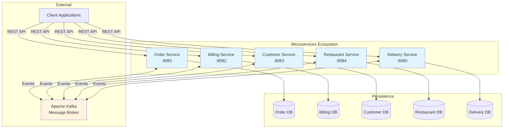
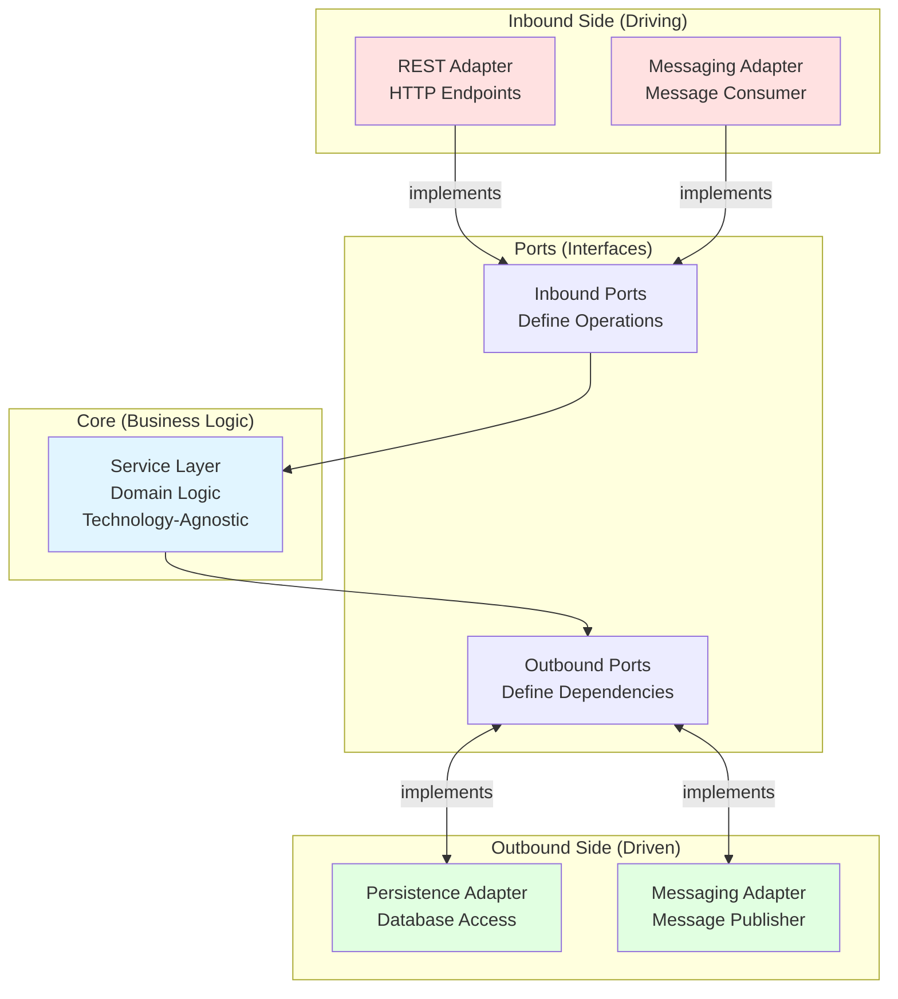
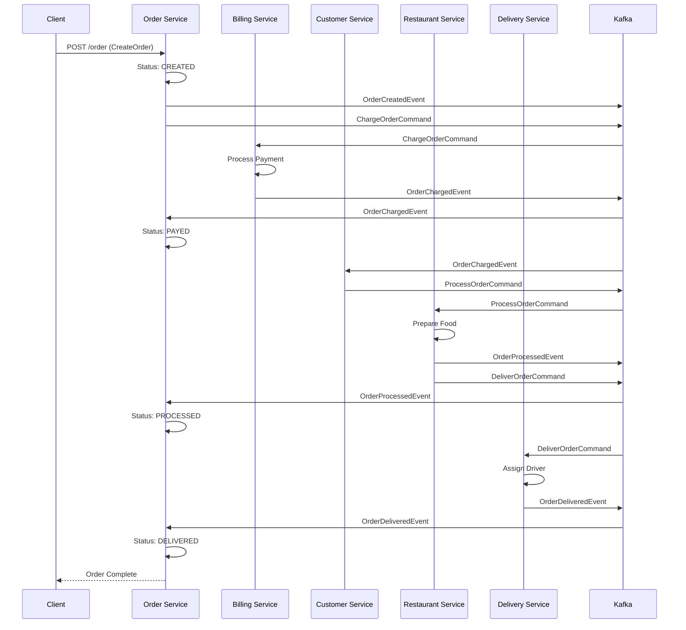
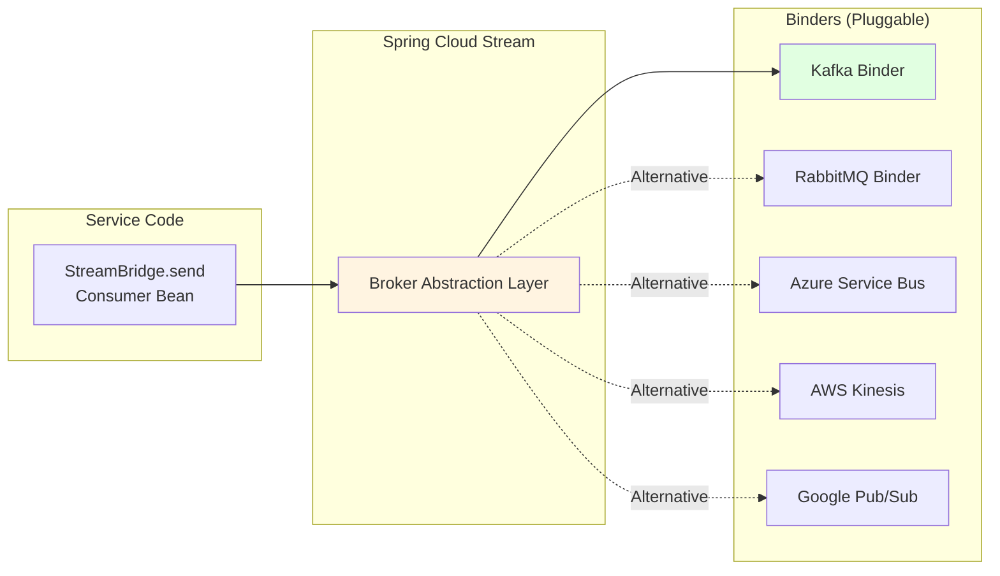
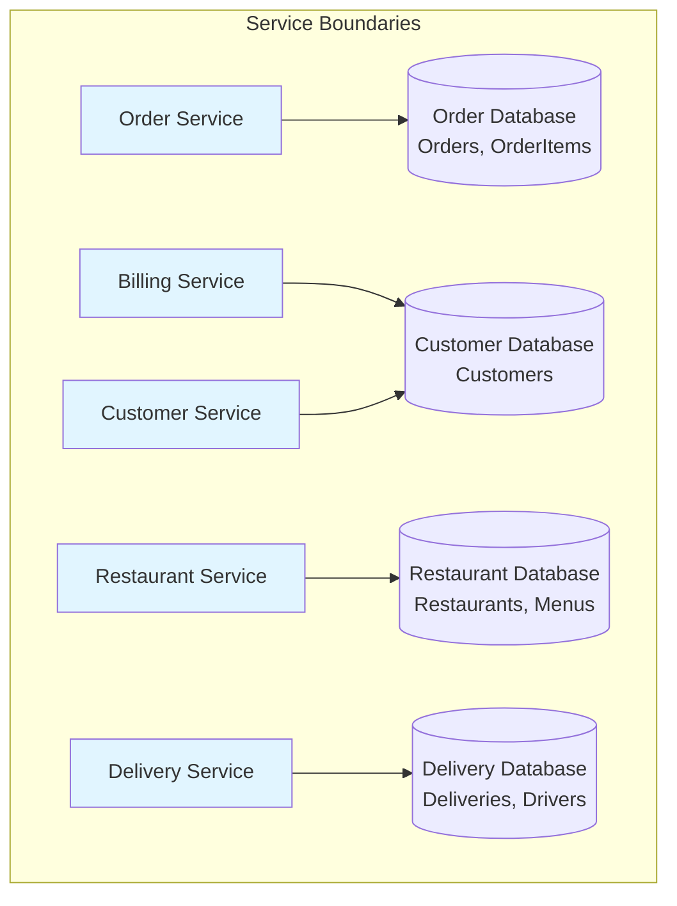
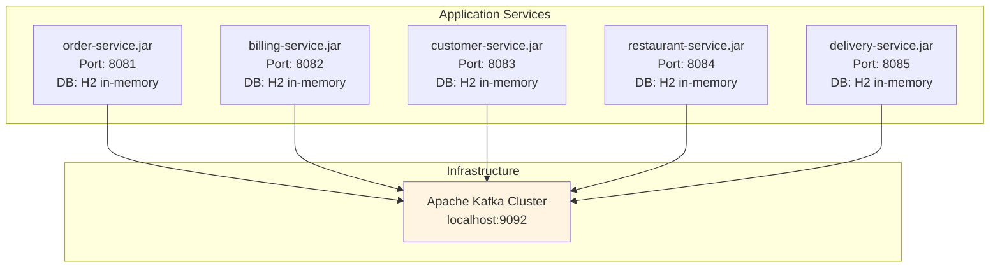

# Architecture Overview

Comprehensive visual guide to the Epic Eats microservices architecture.

## System Context Diagram

High-level view of all the services and their interactions:

**Key Characteristics:**
- **Independent deployment**: Each service runs on its own port (locally, not needed for production)
- **Separate databases**: Database per service pattern (no shared DB)
- **Event-driven communication**: Services communicate via Kafka, using Spring Cloud Stream
- **REST APIs**: Synchronous HTTP endpoints for external clients

## Hexagonal Architecture Pattern

Generic pattern used by all services:

**Benefits:**
- **Testability**: Core logic isolated from frameworks
- **Flexibility**: Easy to swap adapters (e.g., Kafka → RabbitMQ)
- **Maintainability**: Clear separation of concerns
- **Technology independence**: Core has zero framework dependencies

## Message Flow: Order Creation Saga

Complete event-driven workflow across all services:

**Pattern**: Saga with dual orchestration (Order Service + Customer Service)

## Service Responsibilities

| Service | Port | Primary Role | Key Events Published | Key Events Consumed |
|---------|------|--------------|---------------------|---------------------|
| **Order** | 8081 | Orchestrator & state tracker | OrderCreatedEvent, ChargeOrderCommand | OrderChargedEvent, OrderProcessedEvent, OrderDeliveredEvent |
| **Billing** | 8082 | Payment processor | OrderChargedEvent, OrderNotChargedEvent | ChargeOrderCommand |
| **Customer** | 8083 | Customer aggregator + orchestrator | CustomerCreatedEvent, ProcessOrderCommand | OrderChargedEvent, OrderDeliveredEvent |
| **Restaurant** | 8084 | Food preparation + delivery initiator | OrderProcessedEvent, DeliverOrderCommand | ProcessOrderCommand |
| **Delivery** | 8085 | Delivery execution | OrderDeliveredEvent | DeliverOrderCommand |

## Technology Stack Details

### Messaging: Spring Cloud Stream

All services use **[Spring Cloud Stream](https://spring.io/projects/spring-cloud-stream)** for broker-agnostic messaging:

**Current Configuration**: Kafka binder
**Easy Switching**: Change dependency from `spring-cloud-stream-binder-kafka` to any other binder

### Database Per Service

Each service owns its data:

**Benefits**:
- Independent scaling
- Technology diversity (can use different DB types)
- Loose coupling
- Autonomous deployment

## Deployment View

Services and their runtime dependencies:

**Runtime Requirements**:
- Java 17+
- Apache Kafka (localhost:9092)
- Maven (for building)

## Key Design Principles

### 1. Bounded Contexts (DDD)
Each service owns a specific business capability:
- Order → Order lifecycle
- Billing → Payments
- Customer → Customer profiles
- Restaurant → Menus & preparation
- Delivery → Logistics

### 2. Event-Driven Architecture
- **Commands**: Request actions (ChargeOrderCommand)
- **Events**: Announce important business events (OrderCreatedEvent)
- **Choreography**: Services react to events independently

### 3. Hexagonal Architecture
- Clear separation: Adapters ↔ Ports ↔ Core
- Framework isolation in adapters only
- Testable business logic

### 4. Database Per Service
- No shared databases
- Service owns its data schema
- Data consistency via events (eventual consistency)

## Training Path Through Architecture

**Day 1**: Focus on single service (hexagonal pattern)
- Study: [Hexagonal Architecture Example](../../architectural-examples/hexagonal-architecture-example/)
- Practice: Implement Menu Service

**Day 2**: Add communication (REST + Events)
- Study: [order-service](../../reference-services/order-service/README.md) ↔ [billing-service](../../reference-services/billing-service/README.md) interaction
- Practice: Event publishing and consuming

**Day 3**: Multi-service workflows (Sagas)
- Study: Full order creation flow (all 5 services)
- Practice: Saga compensation logic

**Day 4**: Production readiness
- Study: Testing strategies, circuit breakers
- Practice: Resilience patterns

## Related Documentation

- **[Services Communication](03-services-communication.md)** - Detailed message flows and service contracts
- **[Glossary](04-glossary.md)** - Architecture terms explained
- **[Kafka Setup](../setup/kafka-setup.md)** - Broker installation and configuration
- **Service READMEs** - Individual service architecture diagrams (order-service/, billing-service/, etc.)
