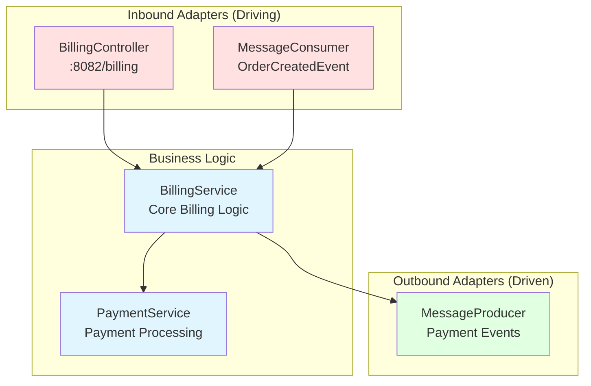

# Billing Service

## Purpose
Handles payment processing and billing operations for orders. Simpler than order-service, making it ideal for learning hexagonal architecture basics.

## Architecture
**Pattern:** Hexagonal Architecture (Ports & Adapters)



### Inbound (Driving)
- **REST API** (`BillingController`) - HTTP endpoints on port 8082
- **Kafka Consumer** (`MessageConsumer`) - Processes OrderCreatedEvent

### Business Logic
- `BillingService` - Core billing operations
- `PaymentService` - Payment processing logic

### Outbound (Driven)
- **Kafka Producer** (`MessageProducer`) - Publishes payment events

## Key Files

| File | Purpose |
|------|---------|
| `BillingController.java` | REST endpoints for billing |
| `BillingService.java` | Business logic |
| `MessageConsumer.java` | Kafka event consumer |
| `MessageProducer.java` | Kafka event publisher |

## API Endpoints

```
POST   /billing/process    - Process payment
GET    /billing/status     - Check billing status
```

## Events Published

- `PaymentCompletedEvent` - When payment succeeds
- `PaymentFailedEvent` - When payment fails

## Events Consumed

- `OrderCreatedEvent` - From order-service (triggers payment)

## Running

```bash
# Start Kafka first
cd reference-services/billing-service
mvn spring-boot:run
```

Access: http://localhost:8082

## Related Training Materials
- **Day 2 Exercise 2:** Event-driven communication patterns
- **Day 3 Exercise 1:** Saga pattern compensation
