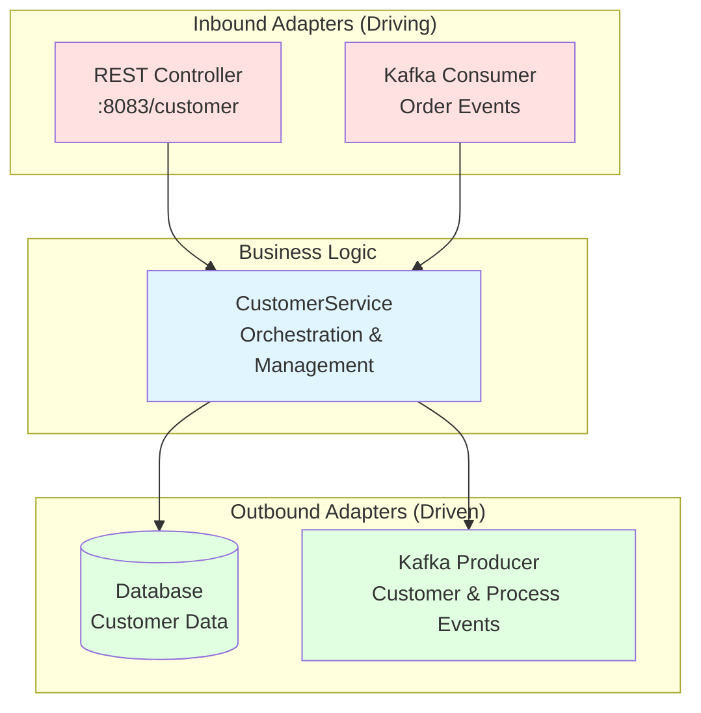

# Customer Service

## Purpose
Manages customer profiles and information. Demonstrates saga orchestration patterns for coordinating multi-service workflows.

## Architecture
**Pattern:** Hexagonal Architecture (Ports & Adapters)



### Inbound (Driving)
- **REST API** - HTTP endpoints on port 8083
- **Kafka Consumer** - Event-driven operations

### Business Logic
- `CustomerService` - Customer management and orchestration logic

### Outbound (Driven)
- **Database** - Customer data persistence
- **Kafka Producer** - Event publishing

## API Endpoints

```
POST   /customer           - Create customer
GET    /customer/{id}      - Get customer by ID
PUT    /customer/{id}      - Update customer
DELETE /customer/{id}      - Delete customer
```

## Events Published

- `CustomerCreatedEvent` - When customer is registered
- `CustomerUpdatedEvent` - When profile is modified

## Events Consumed

- Various orchestration events for saga coordination

## Running

```bash
cd reference-services/customer-service
mvn spring-boot:run
```

Access: http://localhost:8083

## Related Training Materials
- **Day 3 Exercise 1:** Saga orchestration implementation
- **docs/03-service-communication.md:** Service choreography patterns
