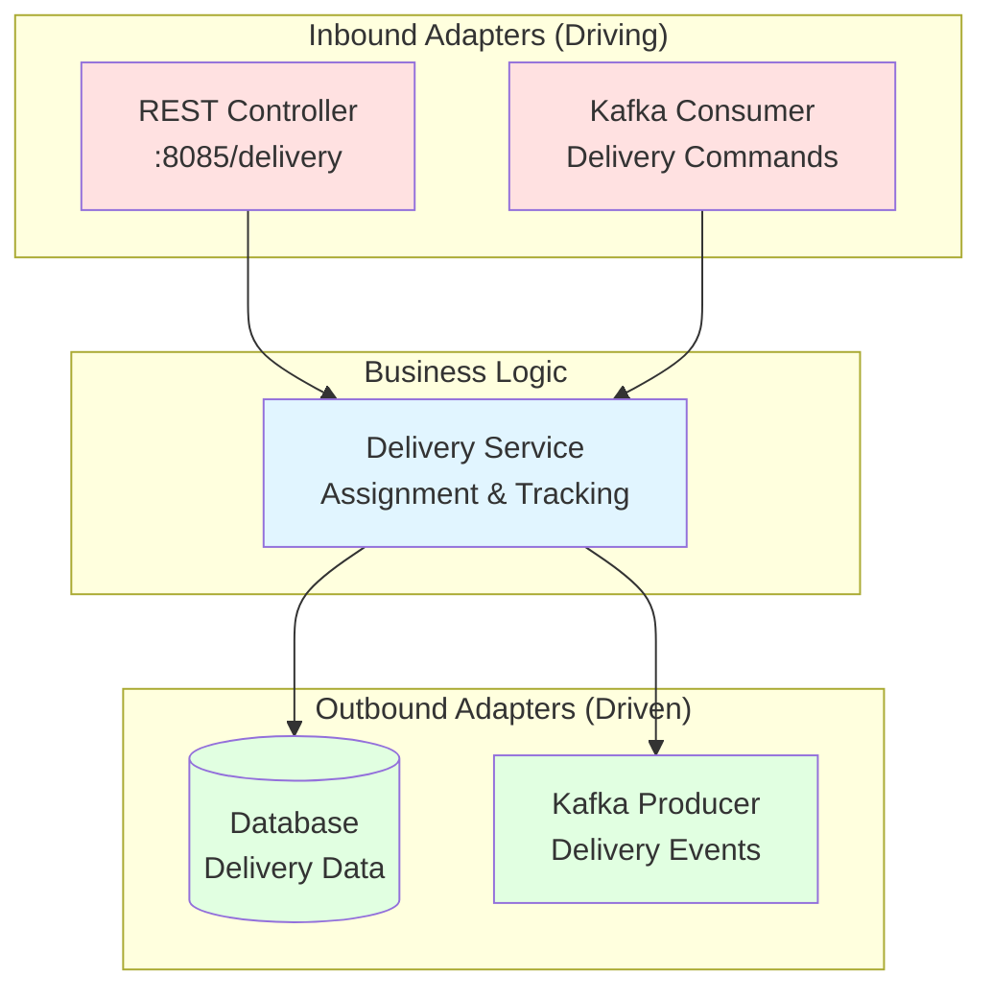

# Delivery Service

## Purpose
Manages delivery assignments, tracking, and logistics for food orders.

## Architecture
**Pattern:** Hexagonal Architecture (Ports & Adapters)



### Inbound (Driving)
- **REST API** - HTTP endpoints on port 8085
- **Kafka Consumer** - Order and delivery events

### Business Logic
- Delivery assignment and tracking logic

### Outbound (Driven)
- **Database** - Delivery data persistence
- **Kafka Producer** - Delivery status events

## API Endpoints

```
POST   /delivery/assign    - Assign delivery driver
GET    /delivery/{id}      - Track delivery status
PUT    /delivery/{id}      - Update delivery status
```

## Events Published

- `DeliveryAssignedEvent` - When driver assigned
- `DeliveryCompletedEvent` - When delivery finished

## Events Consumed

- `OrderCreatedEvent` - From order-service
- `PaymentCompletedEvent` - From billing-service

## Running

```bash
cd reference-services/delivery-service
mvn spring-boot:run
```

Access: http://localhost:8085

## Related Training Materials
- **Day 3:** Saga compensation patterns
- **docs/Microservices interactions.md:** Event choreography
