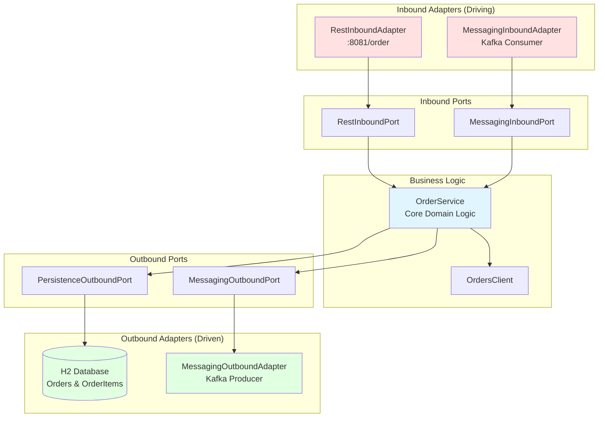

# Order Service

## Purpose
Manages order creation, tracking, and orchestration in the Epic Eats food delivery system. Demonstrates production-grade hexagonal architecture with event-driven communication.

## Architecture
**Pattern:** Hexagonal Architecture (Ports & Adapters)



### Inbound (Driving)
- **REST API** (`RestInboundAdapter`) - HTTP endpoints on port 8081
- **Kafka Consumer** (`MessagingInboundAdapter`) - Listens for events from other services

### Business Logic
- `OrderService` - Core order management logic
- `OrdersClient` - Integration with external services

### Outbound (Driven)
- **Database** (`PersistenceOutboundAdapter`) - H2 database via JPA
- **Kafka Producer** (`MessagingOutboundAdapter`) - Publishes order events

## Key Files

| File | Purpose |
|------|---------|
| `RestInboundAdapter.java` | REST endpoints for order operations |
| `OrderService.java` | Business logic and orchestration |
| `MessagingOutboundAdapter.java` | Event publishing to Kafka |
| `Order.java`, `OrderItem.java` | Domain entities |

## API Endpoints

```
POST   /order              - Create new order
GET    /order/{id}         - Get order by ID
GET    /orders             - List all orders
DELETE /order/{id}         - Delete order
```

## Events Published

- `OrderCreatedEvent` - When new order is created
- `OrderStatusUpdatedEvent` - When order status changes

## Events Consumed

- `PaymentCompletedEvent` - From billing-service
- `DeliveryAssignedEvent` - From delivery-service

## Running

```bash
# Start Kafka first (see docs/Kafka setup.md)
cd reference-services/order-service
mvn spring-boot:run
```

Access: http://localhost:8081

## Related Training Materials
- **Day 1 Exercise 2:** Analyzing hexagonal architecture layers
- **Day 2 Exercise 1:** REST API implementation
- **Day 3 Exercise 1:** Saga orchestration patterns
- **docs/Microservices interactions.md:** System-wide message flows
