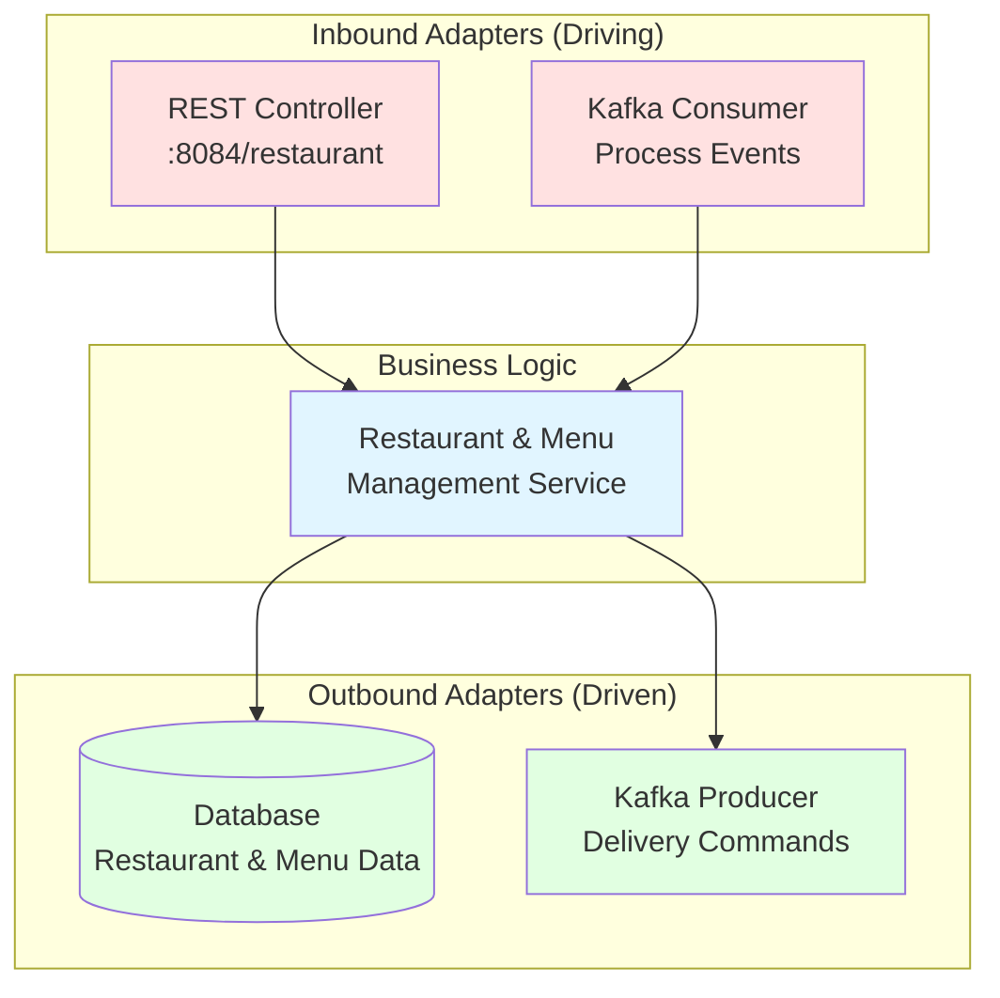

# Restaurant Service

## Purpose
Manages restaurant profiles, menus, and availability. Owns the restaurant and menu item aggregates.

## Architecture
**Pattern:** Hexagonal Architecture (Ports & Adapters)



### Inbound (Driving)
- **REST API** - HTTP endpoints on port 8084
- **Kafka Consumer** - Event processing

### Business Logic
- Restaurant and menu management

### Outbound (Driven)
- **Database** - Restaurant data persistence
- **Kafka Producer** - Event publishing

## API Endpoints

```
POST   /restaurant         - Create restaurant
GET    /restaurant/{id}    - Get restaurant by ID
GET    /menu/{id}          - Get menu items
PUT    /restaurant/{id}    - Update restaurant
```

## Events Published

- `RestaurantCreatedEvent` - When restaurant is registered
- `MenuUpdatedEvent` - When menu changes

## Running

```bash
cd reference-services/restaurant-service
mvn spring-boot:run
```

Access: http://localhost:8084

## Related Training Materials
- **Day 1 Exercise 3:** Use as reference for Menu Service implementation
- **Day 2:** REST API patterns
